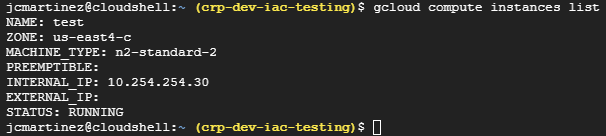
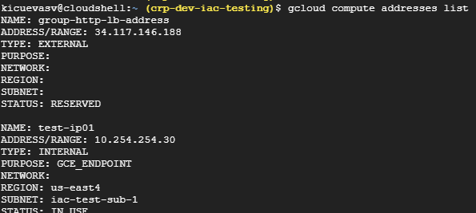
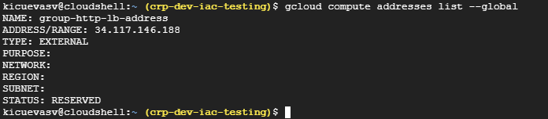
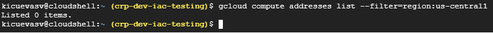
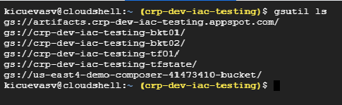
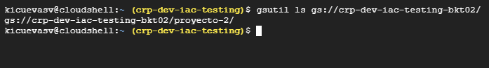

# Tarea 3 - Comandos básicos de gcloud
### Indice
1.- Listar Compute Engine

2.- Listar IP’s en uso, existentes o reservadas

3.- Listar buckets disponibles

4.- Listar Service Accounts existentes en un proyecto

### 1.- Listar Compute Engine

Comando

**gcloud compute instances list**

### 2.- Listar IP’s en uso, existentes o reservadas

Para enumerar las direcciones de un proyecto:

**gcloud compute addresses list**

Para enumerar los URI de todas las direcciones en un proyecto:

**gcloud compute addresses list --uri**

Para enumerar todas las direcciones globales en un proyecto:

**gcloud compute addresses list --global**

Para enumerar todas las direcciones de una region :

**gcloud compute addresses list --filter=region:us-central1**

### 3.- Listar buckets disponibles

Si no se especifica la URL este comando te lista todos los Cloud Storage buckets que se encuentren debajo de tu project ID:

Comando

**gsutil ls**

Si tu especificas una o mas URLs, gsutil ls lista lo que hay en el bucket:

Comando

**gsutil ls gs://**

### 4.- Listar Service Accounts existentes en un proyecto
## ¿Qué es una cuenta de servicio?
Una cuenta de servicio es un tipo especial de cuenta que usa una carga de trabajo de aplicación o procesamiento, en lugar de una persona. Las cuentas de servicio se administran mediante la administración de identidades y accesos (IAM).

## Tipos de cuentas de servicio:
##### 1. Cuentas de servicio administradas por el usuario
##### 2. Cuentas de servicio administradas por Google

### 1. Cuentas de servicio administradas por el usuario
     Las cuentas de servicio administradas por el usuario incluyen cuentas de servicio nuevas que creas explícitamente 
     y la cuenta de servicio predeterminada de Compute Engine.

#### Cuentas de servicio nuevas
     Usa IAM para crear y administrar tus propias cuentas de servicio. 
     Después de crear una cuenta, otórgale roles de IAM y configura instancias para que se ejecuten como cuenta de servicio. 
     Las aplicaciones que se ejecutan en instancias con la cuenta de servicio adjunta pueden usar las credenciales de la cuenta para realizar solicitudes 
     a otras API de Google.

### 2. Cuentas de servicio administradas por Google
    Estas cuentas de servicio (a veces conocidas como agentes de servicio) las crea y administra Google, 
    y se asignan a tu proyecto automáticamente. Estas cuentas representan diferentes servicios de Google y cada cuenta tiene cierto nivel de acceso 
    a tu proyecto de Google Cloud

#### Agente de servicios de las API de Google
     Además de la cuenta de servicio predeterminada, todos los proyectos habilitados con Compute Engine tienen un agente de servicio de las API de Google,
     que se puede identificar mediante el correo electrónico:
     PROJECT_NUMBER@cloudservices.gserviceaccount.com
     Esta cuenta de servicio está diseñada específicamente para ejecutar procesos internos de Google en tu nombre.
     Esta cuenta de servicio solo se borra cuando se borra el proyecto

#### Agente de servicio de Compute Engine
     Todos los proyectos que habilitaron la API de Compute Engine tienen un agente de servicio de Compute Engine, que tiene el siguiente correo electrónico:
     
     ##### service-PROJECT_NUMBER@compute-system.iam.gserviceaccount.com
     Esta cuenta de servicio está diseñada específicamente para que Compute Engine realice las tareas de servicio en tu proyecto. Se basa en la Política de IAM 
     
### Terminología de IAM

#### Permisos
Se verifica en el entorno de ejecución para permitir que los usuarios realicen una operación o accedan a un recurso de Google Cloud.
 A los usuarios no se les otorgan permisos directamente, sin
##### Funciones
Una función es una colección predefinida de permisos. 
También se permiten las funciones personalizadas que consisten en una colección personalizada de permisos.

#### Funciones predefinidas de Data Catalog
Algunas funciones predefinidas de Data Catalog incluyen el administrador, el visualizador y el creador de plantillas 
de etiquetas de Data Catalog. Algunas de estas funciones se describen en las secciones posteriores.

#### Función de administrador
La función roles/datacatalog.admin tiene acceso a todos los recursos de Data Catalog.
Un administrador de Data Catalog puede agregar diferentes tipos de usuarios a un proyecto de Data Catalog.

#### Función de administrador de datos

#### Vista previa
Esta función está sujeta a los Términos de las Ofertas de Disponibilidad Previa al Lanzamiento General de los Términos del Servicio de 
Google Cloud. Es posible que las funciones anteriores a la disponibilidad general sean compatibles y
que los cambios en estas funciones no sean compatibles con otras versiones anteriores. Para obtener más información, 
consulta las descripciones de las fases de lanzamiento.

#### La función roles/datacatalog.dataSteward 
te permite agregar, editar o borrar los administradores de datos y la descripción general 
de texto enriquecido para una entrada de datos, como una tabla de BigQuery.

#### Función de visualizador
A fin de simplificar el acceso a los recursos de Google Cloud, Data Catalog proporciona la función roles/datacatalog.
viewer con permiso de lectura de metadatos para todos los recursos de Google Cloud catalogados.

Esta función también otorga los permisos para ver las plantillas y las etiquetas de Data Catalog.

Otorga la función de visualizador de Data Catalog en tu proyecto para permitir que los usuarios vean los recursos de Google Cloud en Data 
Catalog.

#### Función de creador de plantillas de etiquetas
La función roles/datacatalog.tagTemplateCreator permite a los usuarios crear plantillas de etiquetas.

#### Comando list account

##### gcloud iam service-accounts list 

### Fuentes de Información

#### URLs  Service Accounts existentes en un proyecto

1.- https://cloud.google.com/sdk/gcloud/reference/compute/instances/list

2.- https://cloud.google.com/data-catalog/docs/concepts/iam?hl=es

3.- https://cloud.google.com/compute/docs/access/service-accounts?hl=es-419#google-managed

4.- https://cloud.google.com/compute/docs/access/service-accounts?hl=es-419

5.- https://cloud.google.com/sdk/gcloud/reference/compute/addresses/list

## Integrantes

  
|  Colaborador | Area | Actividad |
| ------------ | ------------ | ------------ |
| damador | Fabrica de pruebas |Documentacion|
| eaalmonasis  |  Infra LINUX |Punto 2"Apoyo eve por errores"|
| kicuevasv  | Base datos ORACLE |Punto 3 "Carga de imagenes"|
| hfulloam  | HyperVisores|Punto 2 "Formato de documento"|
| eczepedah  | Backup |Punto 4 "Apoyo a Edgar A."|
| jcmartinez  | IM PCs Novell |Punto 1|
